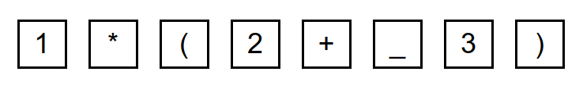
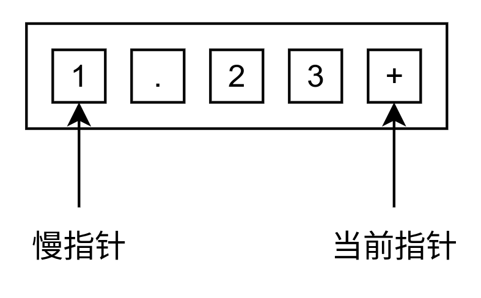

# 第一节：词法分析

## 理论知识

> 在这里抄抄书

编译过程的第一步就是进行词法分析，词法分析的人物是对字符串表示的源程序从左到右地进行扫描和分解，根据语言的词法规则识别出一个一个具有独立意义的单词符号。

在这里我把单词符号命名为 `token` 。

观察一下典型的四则运算表达式，不难看出 `token` 包括了有限的几种符号和数字，没有什么奇怪的东西。

```
1*(2+ 3)
```

这个表达式的 `tokens` 大概长这样（如果考虑课本的内容，最后还有个 # 来着）：



> 以 `_` 代替空格

解析的时候必须要考虑空格，但输出 `tokens` 给下一步的时候不需要输出空格 `token` 。

实际上根据我的经验，代表输入结束的 `token` 也不是必备的，因为有很多方法判断输入是否结束。不过我现在先加上，问题不大，大不了以后删掉。

## 程序设计

### 定义 Token 类

首先在 `src/token/Token.hpp` 文件里面设计一个 `Token` 类。这个类的成员变量记录了三个信息：

```c++
    size_t                      position;  // token 在输入串的位置
    std::variant< Num, Symbol > content;   // token 的内容
    std::string                 origin;    // token 的原输入
```

实话说我想用结构体的，不过在这里给面向对象一个面子，用 Getter/Setter 包装一下，顺便重载 << 运算符方便一会调试。

这里提一下符号的种类定义。
```c++
// 符号种类
enum class Symbol {
    Uninitialized,  // 未定义
    LeftBracket,    // 左括号
    RightBracket,   // 右括号
    Add,            // + 号
    Sub,            // - 号
    Mul,            // * 号
    Div,            // / 号
    Blank,          // 空格
    End,            // 输入结束符号
};
```
包含了我们预期符号的类型。

[enum class 说明](https://zh.cppreference.com/w/cpp/language/enum)

> enum class 是一种比较安全可靠的 enum 。具体意义可以自己去查询。这个说明链接里面的太书面语，我也看不懂。

成员变量中的 
```c++
std::variant< Num, Symbol > content;
```

`std::variant< Num, Symbol >` 是一种既可以是 `Num` ，也可以是 `Symbol` 的玩意，但是只能同时是其中一种。本质上是一种更安全的 union 类型。

这篇文章中有写到这是怎么用的。

[如何优雅的使用 std::variant 与 std::optional](https://zhuanlan.zhihu.com/p/366537214)

我这里用这个的原因是因为 token 的性质，它既可以是一个数字，也可以是一些符号，那么 `std::variant` 就完美符合我的要求。

这里也可以用其他方式实现，比如 `Token` 是基类， `NumToken` 和 `SymbolToken` 是派生类，根据 `GetType()` 成员函数的返回值判断到底是哪个。这样也是一种方法。喜欢继承的可以试试，不过后面我错误处理的时候会大量使用这个玩意，起码你要看懂。

### 定义 TokenParse 类

这个类定义在 `src/token/TokenParse.hpp` 和 `src/token/TokenParse.cpp` 里面。这个类实际上只有一个 static 的函数，属于是给面向对象一个面子的结果。本质上就是一个全局函数。

> 你直接定义全局函数也是一样的。

解析输入的函数签名长这样：

```
static std::variant< std::vector< Token >, std::string > Parse(const std::string &input);
```

输入很好理解，一个字符串。
输出就是一个 `std::variant< std::vector< Token >, std::string >` ，假设解析成功了就返回 `std::vector< Token >` ， 假设解析失败就返回一个 `std::string` 报告错误原因。

#### 题外话

这里的设计涉及到了异常处理的发展史。

最开始的时候，C 语言选择了返回 error_code 这招，通过返回一个数字得到当前函数是否出错，真正的返回值通过参数传递一个指针返回。

之后的 Java 选择了 try/catch 这种方式处理。

Go 语言选择的是返回一个 (result, err) 的元组。 result 和 err 其中必有一个为空，通过这个判断函数有没有出现异常。

Rust 语言选择返回一个 Result 类型，返回值要么是 Ok 要么是 Err 。

我最喜欢的是 Rust 的异常处理方式，所以这里用了类似的技巧进行拙劣的模仿。C++ 对这几种处理方式都支持。具体选择看你心情。如果你用了对应语言，请使用这个语言的官方推荐方式处理。C++ 这种什么都支持的混乱邪恶当然是想用什么用什么。

#### 算法的设计

本质上设计是把输入串的每个字符拿来和符号对比，如果不是符号就默认为数字，丢进解析数字的函数处理。

输入处理用了快慢指针（大概是这么个名字吧）。



慢指针指向第一个未被处理的位置。当前指针指向一个符合 `'(', ')', '+', '-', '*', '/', ' '` 或者输入字符串的末尾的时候，把慢指针到当前指针这一段字符串 "1.23" 截取出来，丢到 `parse_number` 函数里面解析。

```c++
// 字符串转 double
std::variant< double, std::string > parse_number(const std::string &input) {
    try {
        size_t pos;
        double out = std::stod(input, &pos);
        // pos 代表函数处理了多少个字符，比如 "2a" 处理的结果是 out = 2 ， pos = 1
        if (pos != input.length()) {
            // 接上面的情况，如果函数没有解析完输入的字符串，证明解析失败，返回错误。
            return std::string("遇到未预期的输入: '" + input + "' ！");
        }
        return out;
    }
    catch (std::invalid_argument &_) {
        return std::string("遇到未预期的输入: '" + input + "' ！");
    }
}
```

[std::stod 的说明](https://zh.cppreference.com/w/cpp/string/basic_string/stof)

> 这里可以看出 C++ 官方标准库用的是 try/catch 这种异常处理方式，有时候也混用 C 风格而的异常处理（看这个函数是不是 C 遗产）。因为 try/catch 有很大的问题所以我能避免就避免。C++17 起也支持不抛异常的 std::from_chars 操作，有想法的可以自己修改看看。

剩下的函数实现可以看代码。

## 使用及测试

把 `main` 函数改改，运行一下看看结果。

```c++ 
#include "token/TokenParse.hpp"
#include <iostream>

using std::cout;
using std::endl;
using std::string;

int main(int argc, char **argv) {
    string input = "1.23e1 + 3";
    cout << "输入字符串为: " << input << endl;
    auto re = TokenParse::Parse(input);

    if (re.index() == 0) {
        auto vec = std::get< std::vector< Token > >(re);
        for (auto &token : vec) {
            cout << token << endl;
        }
    }
    else {
        cout << std::get< string >(re) << endl;
    }
    return 0;
}

```

输出：

```
输入字符串为: 1.23e1 + 3
token:{ position: 0, content: Num(12.3), origin: "1.23e1"}
token:{ position: 7, content: '+', origin: "+"}
token:{ position: 9, content: Num(3), origin: "3"}
token:{ position: 10, content: '#', origin: "3"}
```

输入改成 "5 + 13a - 45" 试试

```
输入字符串为: 5 + 13a - 45
在位置 4 处遇到遇到未预期的输入: '13a' ！
```

搞定！

## 后记

轻小说真好看，我沉迷轻小说一星期，手游都差点忘记签到。现在看来写文档花的时间大概是编码的2-3倍左右，我果然不擅长写文档。实际上写完这篇文章，我认为大部分人都能用自己擅长的语言完成词法分析工作，并不拘泥于 C++ 。毕竟这个真的很简单。下一章我会使用和我的 Rust 版本不同的代码完成，希望人没事（逃）。

